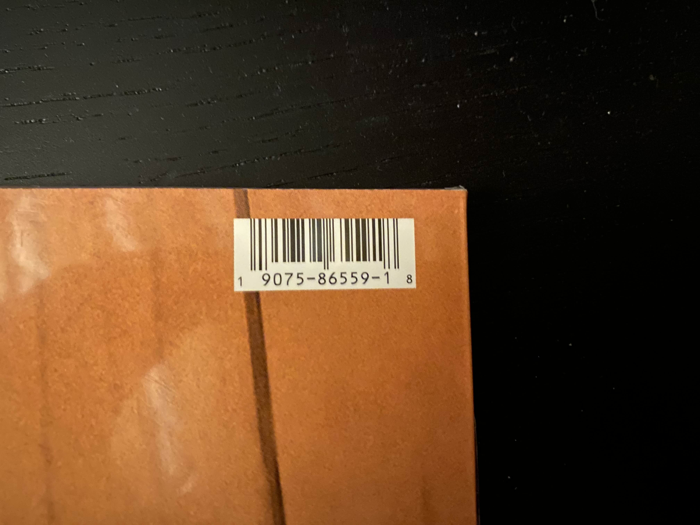

# Personnal Vinyl Collection

## Goal

this project is made to be self-hosted so you can know what vinyls you have and dont have when you're in a record shop.

This project is not finished yet, lots of things are going to change like the way i handle the data (in json for the moment), load the pages, the deployement (will use a dockerfile later), the UI, etc.

i'm also going to add a wishlist some day where you can search for an artist and name of an album and add it to your wishlist.

## Requirements

```bash
pip install -r requirements.txt
```

Depending on how you want to handle the data there's two methods available. Either you want to store Discogs' database using their [monthly dump](https://discogs-data-dumps.s3.us-west-2.amazonaws.com/index.html) or you'll go the easy way and create an account on [Discogs's website](https://www.discogs.com/) and get an API key [here](https://www.discogs.com/settings/developers) (you can use an app token or a personal access token).

Once you have generated the API key, you'll need to create a `.env` file like the `.env.example` and pass your API key.

## Usage

Since the project is not even close to be finished, I didn't bother creating a Dockerfile and a docker-compose file. For the moment all you'll need to do is run :
```bash
python app.py
```

If you want, you can easily create a Dockerfile/docker-compose file to have it behind a reverse proxy for simple access.

The app is using UPC codes to find the vinyls you have, simply enter the UPC code of your vinyls and you'll have the list ordered by artist in alphabetical order then release date.

## Example

Let's add Toxicity by System of a Down to my list.

First open up the website and click on the "+" button in the bottom right corner and then entend the UPC of the vinyl that can be find, in that case, in the top right corner of the backside of the album as shown in the picture below. You'll want to exclude the first and last digit of the UPC code.



Then click the "Add vinyl" button and the album should appear on the main page. You can see its name, artist, tracklist and release date.